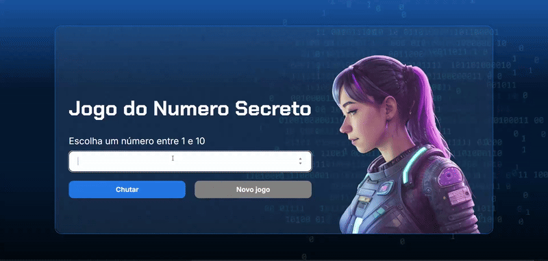

# Jogo do Número Secreto


Um divertido jogo de adivinhação desenvolvido como parte do programa **Oracle Next Education (ONE)**, em parceria com a **Alura**. O objetivo é descobrir um número secreto gerado aleatoriamente.



### 🚀 Sobre o Projeto

Este projeto foi criado para aplicar conceitos fundamentais de JavaScript, aprendidos durante a formação ONE. O jogo desafia o usuário a adivinhar um número entre 1 e 10, fornecendo dicas se o palpite é maior ou menor que o número secreto.

Uma característica especial deste projeto é o uso da biblioteca `ResponsiveVoice.js` para fornecer feedback por voz em português do Brasil, tornando a experiência mais interativa e acessível.

---

### ✨ Funcionalidades

- **Geração de Número Aleatório:** Um número secreto é gerado a cada nova partida.
- **Feedback Interativo:** O jogo informa se o palpite do usuário é maior ou menor que o número secreto.
- **Contador de Tentativas:** Ao acertar, o jogador é informado de quantas tentativas precisou.
- **Feedback por Voz:** Todas as instruções e dicas são narradas, utilizando a API `ResponsiveVoice.js`.
- **Reiniciar o Jogo:** O botão "Novo Jogo" permite iniciar uma nova rodada a qualquer momento.
- **Não Repetição de Números:** O jogo armazena os números já sorteados para evitar que se repitam em rodadas consecutivas, até que todas as possibilidades tenham sido usadas.

---

### 🛠️ Tecnologias Utilizadas

O projeto foi desenvolvido com as seguintes tecnologias:

- **HTML5**
- **CSS3**
- **JavaScript**
- **ResponsiveVoice.js:** Para a funcionalidade de text-to-speech.
- **Google Fonts:** Para a estilização da fonte.

---

### ▶️ Como Executar

1. Clone o repositório:
   ```sh
   git clone https://github.com/Gabriel-Souza-Tech/secret-number-game.git
   ```
2. Abra o arquivo `index.html` em seu navegador de preferência.
3. Divirta-se!
